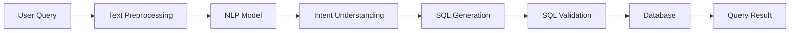

# Natural Language to SQL Query System

A Text-to-SQL application that enables users to interact with relational databases using natural language. The system converts user questions into executable SQL queries, allowing non-technical users to retrieve data without writing SQL statements manually.

The solution combines Natural Language Processing (NLP), transformer-based models, and API services to translate business questions into structured database queries.

---

## Business Problem

Organizations store large amounts of information in relational databases. Accessing this information often requires knowledge of SQL, which creates a barrier for business users.

Common challenges include:

* Limited SQL knowledge among business teams
* Dependence on technical teams for reporting
* Time-consuming data retrieval processes 
* Difficulty translating business questions into SQL queries

---

## Project Goal

Develop a system that enables users to retrieve database information using natural language.

Example:

**User Question**

```text
What was the total revenue generated last quarter?
```

**Generated SQL**

```sql
SELECT SUM(revenue)
FROM sales
WHERE quarter = 'Q4';
```

---

## Solution Overview

The application uses transformer-based NLP models to understand user intent and generate SQL queries.

The workflow includes:

1. Natural language query processing
2. Intent understanding
3. SQL generation
4. Query validation
5. Database execution
6. Result delivery

This enables users to interact with structured databases through conversational language.

---

# Architecture



---

## End-to-End Workflow

### Query Processing

1. User submits a natural language question.
2. Text is preprocessed and normalized.
3. Transformer models analyze query intent.
4. SQL statements are generated.
5. Generated SQL is validated.
6. Query is executed against the database.
7. Results are returned to the user.

---

## Key Features

### Natural Language Interface

Allows users to interact with databases using conversational language.

### Text-to-SQL Generation

Automatically converts business questions into SQL statements.

### Transformer-Based Architecture

Uses transformer models for language understanding and SQL generation.

### Real-Time Query Execution

Generated SQL can be executed through API endpoints.

### Complex Query Support

Supports:

* Aggregations
* Filtering
* Grouping
* Sorting
* Multi-table queries

### API Integration

Provides REST APIs through Flask or FastAPI.

---

## Example Query

### User Input

```text
Show the top 5 products by revenue.
```

### Generated SQL

```sql
SELECT product_name,
       SUM(revenue) AS total_revenue
FROM sales
GROUP BY product_name
ORDER BY total_revenue DESC
LIMIT 5;
```

---

## Example API Request

### Request

```json
{
  "query": "Show the top 5 products by revenue"
}
```

### Response

```json
{
  "generated_sql": "SELECT product_name, SUM(revenue) AS total_revenue FROM sales GROUP BY product_name ORDER BY total_revenue DESC LIMIT 5;"
}
```

---

## Architecture Components

| Component        | Responsibility                     |
| ---------------- | ---------------------------------- |
| User Interface   | Accepts natural language questions |
| NLP Engine       | Understands query intent           |
| SQL Generator    | Produces SQL statements            |
| Validation Layer | Checks generated SQL               |
| Database Layer   | Executes SQL queries               |
| API Layer        | Exposes query services             |

---

## Project Structure

```text
natural-language-to-sql-system/

├── data/
│
├── models/
│
├── sql_generation/
│
├── api/
│
├── app.py
├── requirements.txt
├── README.md
└── .gitignore
```

---

## Technology Stack

* Python
* BERT
* T5
* Hugging Face Transformers
* PyTorch
* Flask
* FastAPI
* SQL Databases

---

## Technical Concepts Demonstrated

* Natural Language Processing (NLP)
* Text-to-SQL Systems
* Transformer Models
* BERT
* T5
* Intent Recognition
* SQL Generation
* REST API Development
* Query Processing Pipelines

---

## Dataset

The system is trained and evaluated using the Spider dataset, a widely used benchmark for Text-to-SQL tasks.

The dataset contains:

* Natural language questions
* Database schemas
* Corresponding SQL queries

This enables the model to learn SQL generation across diverse database structures.

---

## Getting Started

### Clone Repository

```bash
git clone https://github.com/<your-username>/natural-language-to-sql-system.git
cd natural-language-to-sql-system
```

### Create Virtual Environment

```bash
python -m venv .venv
```

### Install Dependencies

```bash
pip install -r requirements.txt
```

### Run Application

Flask:

```bash
python app.py
```

FastAPI:

```bash
uvicorn app:app --reload
```

---

## Use Cases

* Self-service analytics
* Business reporting
* Data exploration
* Database querying assistance
* Internal enterprise data access
* Conversational analytics systems

```
```
